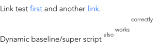
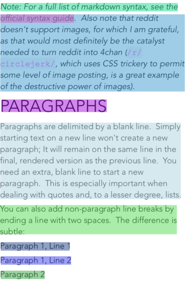

# DYLabel



Superscript, links, and more!



First class accessibility support with accurate text framing and paragraph based navigation!

## Features
* Over 5.5x faster to size, layout, and draw than UILabel
* Always provides an accurate line height (even with superscript, emoji, etc). This is very important as most others (TTTAttributedLabel, AttributedLabel, DTAttributedTextView, etc) often return inaccurate line heights with complex attributed strings. All, for example, fail in different ways with the demo above.
* Supports VoiceOver (with paragraph navigation) and other accessibility technologies
* Supports hyperlinks (both clicking and press-and-hold)
* Supports link font color customization through `NSForegroundColorAttributeName`
* Supports iOS >=9

## Using it

You have two options. First, you can simply add this repo as a Swift Package Manager package and import the `DYLabel` library. This is recommend so that you receive updates. Alternatively, you may simply copy `Sources/DYLabel.swift` into your project. And...that's it!

Check out `ViewController.swift` in the demo for a crash-course on how to use DYLabel.

A few key notes:

* It is highly recommended that you use the convenience init function `init(attributedText attributedTextIn:NSAttributedString, backgroundColor backgroundColorIn:UIColor?, frame:CGRect)` to ensure that everything the label needs is ready from the get go
* If you are not using the convenience init (i.e. using interface builder) you must set `.attributedText` before `draw(_ rect: CGRect)` is called by the OS. An empty string is acceptable however it may not be nil
* To receive link click callbacks, you must implement DYLinkDelegate and then set the `.dyDelegate` property of labels correctly


## Benchmarks

There are two expensive phases in the drawing of a label. The first is framing/height calculation and the second is the actual drawing and displaying of text. Both will be tested here using a very complex and large attributed string.


```
func drawMeasure(_ title: String, view:UIView) {
    let startTime = CFAbsoluteTimeGetCurrent()
    let iterations = 1000
    
    UIGraphicsBeginImageContext(self.view!.bounds.size)
    let context = UIGraphicsGetCurrentContext()!
    for _ in 0..<(iterations) {
        autoreleasepool {
            context.saveGState()
            view.draw(self.view!.bounds)
            context.restoreGState()
        }
    }
    
    UIGraphicsEndImageContext()
    
    let timeElapsed = (CFAbsoluteTimeGetCurrent() - startTime) * 1000
    print("Draw time for \(iterations) iterations (ms) \(title): \(timeElapsed)")
}

...

measure("DYLabel - height") {
    let _ = DYLabel.size(of: s!, width: self.view.frame.width)
}

measure("TTTAttributedLabel - height") {
    //Returns incorrect sizes, TTT is broken! Included just for comparison
    let _ = TTTAttributedLabel.sizeThatFitsAttributedString(s!, withConstraints: CGSize.init(width: self.view.frame.width, height: CGFloat.greatestFiniteMagnitude), limitedToNumberOfLines: 0)
}

measure("UILabel - height") {
    let _ = s?.boundingRect(with: CGSize.init(width: self.view.frame.width, height: CGFloat.greatestFiniteMagnitude), options: [NSStringDrawingOptions.usesLineFragmentOrigin, NSStringDrawingOptions.usesFontLeading], context: nil)
}

do {
    let l = DYLabel.init(frame: r)
    l.attributedText = s
    drawMeasure("DYLabel", view: l)
}

do {
    let l = TTTAttributedLabel.init(frame: r)
    l.numberOfLines = 0
    l.setText(s)
    drawMeasure("TTTAttributedLabel", view: l)
}

do {
    let l = UILabel.init(frame: r)
    l.numberOfLines = 0
    l.attributedText = s
    drawMeasure("UILabel", view: l)
}
```

```
Runtime for 1000 iterations (ms) DYLabel - height: 2163.864016532898
Runtime for 1000 iterations (ms) TTTAttributedLabel - height: 1994.5310354232788
Runtime for 1000 iterations (ms) UILabel - height: 8317.120909690857


Draw time for 1000 iterations (ms) DYLabel: 2859.1389656066895
Draw time for 1000 iterations (ms) TTTAttributedLabel: 3037.634015083313
Draw time for 1000 iterations (ms) UILabel: 19235.720038414
```

In total: DYLabel took 5023ms, TTT took 5032ms, and UILabel took 27552ms.